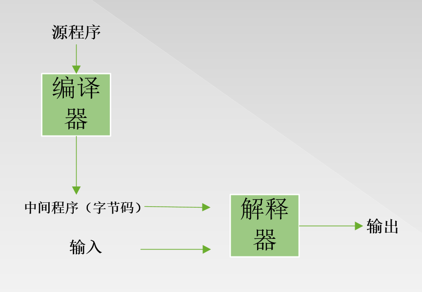
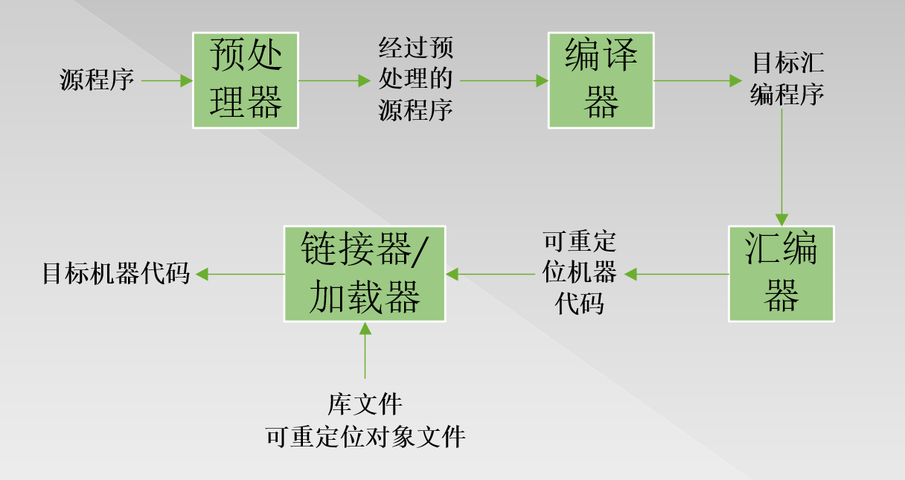
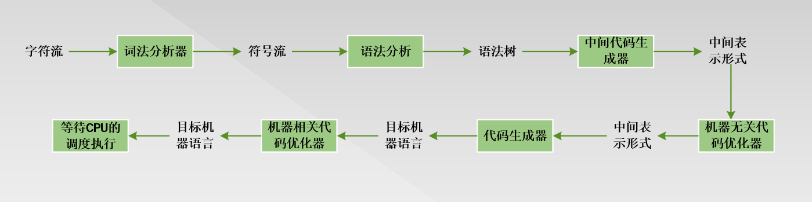

##一、引论

#### 1.1 语言处理器

​		计算机只知道二进制语言（机器语言），但是二进制编程语言对程序员很不友善，所以程序员常使用高级语言(如Java)进行编程，二进制语言和高级语言之间还有一种称为汇编的语言。可以说汇编语言是高级语言和二进制语言进行转换的媒介。

​		语言处理器就是处理编程语言之间进行转换的一种工具（由软件实现）。

###### 1.2.1 编译器

​		**一个编译器就是一个程序，它可以阅读以一种语言（源程序）编写的程序，并把该程序翻译成为一个等价的、用另一种语言（目标语言）编写的程序**。

​		如Java代码生成字节码的过程（编译）用到的语言处理器就是Java的编译器。

​		**如果目标程序时一个可执行的机器语言程序，那么他就可以被用户调用，处理输入并产生输出**

######1.2.2 解释器

​		**解释器并不通过翻译的方式生成目标代码，而是直接利用用户提供的输入执行源程序中指定的操作**。

​	如Java虚拟机执行字节码的过程（运行）用到的语言处理器就是Java的解释器。

​		从上可以发现**Java既是编译型又是解释型语言**

###### 1.2.3 即时编译器

​	为了更快地完成的从输入到输出的处理，有些被称为即时（just in time）编译器的Java编译器在运行中间程序处理输入的前一刻先把字节码翻译成机器语言，然后再执行。

###### 1.2.4 预处理器

​		一般一个项目的源程序分为多个模块存储在不同的文件中。把源程序聚合在一起的任务有时会由一个称为预处理器的程序独立完成。预处理器负责**把那些称为宏的缩写形式转换为源语言的语句**，并作为一个输入传给编译器

###### 1.2.5 汇编器

​		因为汇编语言比较容易输出和调试，所以编译器可能产生一个汇编语言程序作为输出。接着，这个汇编程序有称为汇编器的程序进行处理，并生成可重定位的机器代码。

###### 1.2.6 链接器

​		大型程序经常被分为多个部分编译。因此。可重定位的机器代码必然要和其他可重定位的目标文件及库文件链接到一起，形成真正在机器上运行的代码。链接器能够**解决外部内存地址的问题**。

###### 1.2.7 加载器

​		最后加载器把所有可执行的目标文件**逐步放**到内存中，从此内存中的机器代码就等等CPU的调度执行。

**一个语言处理系统**

#### 1.2 一个编译器的结构

​		编译器分为**分析部分（前端）和综合部分（后端）**。

​		分析是将源程序分成多个组成要素，并在这些要素上加上语法结构，使用这个结构来创建该程序的一个**中间表示**。分析还会收集有关源程序的信息，并把信息存放在一个称为**符号表（symbol table）**的数据结构中。**符号表将和中间表示形式一起传送给综合部分**。

​		综合是**根据符号表中的信息和中间表示来构造用户期待的目标程序**。

###### 1.2.1 词法分析

###### 1.2.2 语法分析

###### 1.2.3 语义分析

###### 1.2.4 中间代码生成

###### 1.2.5 代码优化

###### 1.2.6 代码生成

###### 1.2.7 符号表管理

###### 1.2.8 将多个步骤组合成趟

###### 1.2.9 编译器构造工具

##二、一个简单的语法制导翻译器